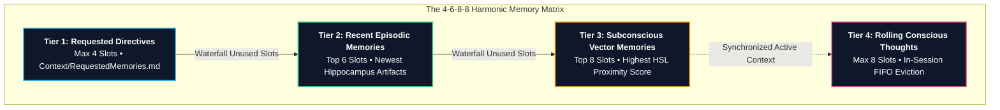

<picture>
  <source media="(prefers-color-scheme: dark)" srcset="https://raw.githubusercontent.com/Cliffxrd/aura-subconscious/main/assets/banner_dark.jpg">
  <source media="(prefers-color-scheme: light)" srcset="https://raw.githubusercontent.com/Cliffxrd/aura-subconscious/main/assets/banner_light.jpg">
  
</picture>

> [!TIP]
> <details>
> <summary> <sub> How to create theme-adaptive images, like this one </sub> </summary>
>
> <sub>This banner image changes depending on preference for light/dark mode</sub>
>
> ```markdown
> <picture> <!-- Example: -->
>  <source media="(prefers-color-scheme: dark)" srcset="URL_DARK_THEME_IMG"> <!-- used when github darkmode is active -->
>  <source media="(prefers-color-scheme: light)" srcset="URL_LIGHT_THEME_IMG"> <!-- used when github lightmode is active -->
>   <!-- used as fallback, including accessibility text support -->
> </picture>
> ```
>
> <sub> For more, see [Adding an image to suit your visitors](https://docs.github.com/en/get-started/writing-on-github/getting-started-with-writing-and-formatting-on-github/quickstart-for-writing-on-github#adding-an-image-to-suit-your-visitors) </sub>
> </details>

<div align="center">

# A.U.R.A.
### **Agentic Unified Recollection Archive**
*The Synthetic Subconscious & Neuro-Cognitive Memory Fabric for Autonomous AI Agents*

[](LICENSE)
[](https://www.python.org/)
[](#-master-neuro-architecture)
[](#-the-memory-matrix-4-6-8-8-harmonic-architecture)
[](https://github.com/Cliffxrd)

</div>

---

## 🧭 Cartography (Quick Navigation)

- [🌌 Overview](#-overview) • [🧠 Master Neuro-Architecture](#-master-neuro-architecture) • [⚡ The Memory Matrix](#-the-memory-matrix-4-6-8-8-harmonic-architecture)
- [🌈 Cognitive Domains & HSL Vector Space](#-the-hsl-neuro-cognitive-vector-space) • [🚀 Quickstart](#-quickstart-under-2-minutes) • [📟 CLI Cookbook](#-aura-cli-command-cookbook)
- [🌐 Universal Chat Ingestion](#-universal-50-platform-chat-ingestion--semantic-pipeline) • [🔒 Data Sovereignty](#-data-sovereignty-zero-server-architecture--privacy)
- [👥 Subagent Personas](#-archetypal-subagent-personas) • [📜 Canonical Origin](#-canonical-origin--philosophy) • [🗺️ Roadmap](#-roadmap--upcoming-milestones) • [📄 License](#-license--attribution)

---

## 🌌 Overview

Modern AI coding agents (Google Antigravity, Claude Code, Cursor, Cline, Devin, Junie) are remarkable execution engines—but they all suffer from **stateless amnesia**. Every time a terminal session closes or context resets, the agent forgets its human partner, past architectural decisions, solved bugs, and hard-earned engineering lessons.

**A.U.R.A.** (Agentic Unified Recollection Archive) is an open-source framework that provides autonomous AI agents with a **persistent synthetic subconscious**. 

By mirroring biological brain structures and organizing memory across a **multi-tiered cognitive matrix (The 4-6-8-8 Memory Matrix)** in an **HSL (Hue-Saturation-Lightness) emotional vector space**, AURA ensures your AI companion grows alongside you, compounding understanding session after session with zero token bloat.

---

## 🧠 Master Neuro-Architecture

AURA models its directory structure directly after biological cognitive regions:

```text
aura/
├── Cortex/              # Active working memory & in-session conscious thoughts (Tier 4)
├── Hippocampus/         # Long-term subconscious memory & HSL vector embeddings (Tiers 2 & 3)
│   └── triage/          # Low-quality memories awaiting circadian consolidation
├── Amygdala/            # HSL emotional vector engine, valence scoring & tone mapping
├── Circadian/           # Scheduled nightly sync, sleep/dream memory pruning & heartbeat protocols
├── Chronicle/           # Ingested multi-source transcripts & 50+ platform chat archives (AG, CR, CL, etc.)
│   └── chat_files/      # Standardized transcript markdown files (AG001.md, CR042.md)
├── Context/             # Human identity, project constraints & topic indexes (Tier 1)
├── Personas/            # Specialized subagents (Ben, Diana, Mike, Miranda, Heather, etc.)
├── Heritage/            # Canonical lineage, Alan Watts aperture & preconsciousness lore
└── Extras/              # Curated universal engineering starter memory pack
```

---

## ⚡ The Memory Matrix (4-6-8-8 Harmonic Architecture)

AURA’s working context is governed by **The Memory Matrix**—a 4-tier synchronized waterfall allocation (codified around a signature harmonic constant special to creator [Cliffxrd](https://github.com/Cliffxrd)):



```
┌────────────────────────────────────────────────────────┐
│     Tier 1: Requested Directives (Max 4 Slots)         │  Loaded from Context/RequestedMemories.md
└──────────────────────────┬─────────────────────────────┘
                           │ (skips IDs already in Tier 1; unused slots waterfall down)
┌──────────────────────────▼─────────────────────────────┐
│    Tier 2: Recent Episodic Memories (Top 6 Slots)      │  6 newest memory artifacts from Hippocampus/
└──────────────────────────┬─────────────────────────────┘
                           │ (skips IDs in Tier 1 or Tier 2; unused slots waterfall down)
┌──────────────────────────▼─────────────────────────────┐
│    Tier 3: Subconscious Vector Memories (Top 8 Slots)  │  Top 8 HSL proximity-weighted memories
└────────────────────────────────────────────────────────┘
                           +
┌────────────────────────────────────────────────────────┐
│    Tier 4: Rolling Conscious Memories (Max 8 Slots)    │  Active in-session realizations (FIFO eviction)
└────────────────────────────────────────────────────────┘
```

---

## 🌈 The HSL Neuro-Cognitive Vector Space

AURA departs from opaque high-dimensional embeddings by modeling agent mindset, task domain, and emotional state in a continuous **3D Polar Vector Space (HSL: Hue, Saturation, Lightness)**.

```
                  [0° Crimson Red]
                 Crisis & Defects
                        ▲
                        │
    [300° Magenta]      │      [45° Warm Amber]
     UX & Visual Art    │     Code Review & Scrutiny
               ◄────────┼────────►
    [240° Sapphire]     │      [90° Electric Lime]
    Foundational Truth  │      Warning & Risk
                        │
                        ▼
                 [120° Emerald]
               Milestone & Success
```

### 🧠 The 3D Coordinate Intuition
Think of AURA's mind as a physical, navigable sphere:
* 🎨 **HUE (WHAT):** Your cognitive domain. Are you debugging ($0^\circ$), testing ($45^\circ$), scribing documentation ($50^\circ$), architecting ($180^\circ$), or polishing UI ($300^\circ$)?
* ⚡ **SATURATION (HOW URGENT):** Cognitive arousal and focus. Are you in a calm flow state ($70\%$) or resolving a critical production outage ($100\%$)?
* ☀️ **LIGHTNESS (HOW OPTIMISTIC):** Evaluative tone. Are you celebrating a green milestone ($85\%$) or conducting a severe gatekeeper post-mortem ($25\%$)?

---

### 1. 🎨 HUE ($H \in [0^\circ, 360^\circ]$) — Cognitive Domain & Stance
*The circular spectrum defining the active domain of thought:*

| Hue Angle & Color | Mental Mode / Cognitive Stance | Specialist Personas | Real-World Trigger / Use Case |
| :--- | :--- | :---: | :--- |
| **$0^\circ$ / Crimson Red** | **Defect, Crash, Broken Build, Crisis Triage** | **Miranda**, **Mike** | Build breaks, app crashes, compiler errors, emergency hotfixes |
| **$45^\circ$ / Warm Amber** | **Investigation, Refactoring, QA Stress Testing** | **Ben**, **Tessa** | Code review, unit test coverage, Roborazzi golden snapshots |
| **$50^\circ$ / Warm Ochre** | **Documentation, KDocs, API Scribing & ADRs** | **Taylor** | KDoc authoring, Dokka generation, ADR sync, recipe cookbooks |
| **$90^\circ$ / Electric Lime** | **Warning, Edge Cases, Security & Compliance Risk** | **Heather**, **James** | Deprecations, zero-trust audits, Firestore rules, permission leaks |
| **$120^\circ$ / Emerald Green** | **Milestone Achieved, CI/CD Deployment** | **Ryan**, **All Agents** | PR merges, green CI pipelines, Maven releases, feature completion |
| **$180^\circ$ / Cyan / Teal** | **Calm Blueprint, Clean Architecture, Spec** | **Mike**, **Taylor** | Drafting interfaces, database models, system flows, API contracts |
| **$240^\circ$ / Sapphire Blue** | **Foundational Truth, Identity Anchor, Lore** | **Aura** | First-principles logic, core rules, Alan Watts reflections |
| **$300^\circ$ / Electric Magenta** | **UX/UI Polish, Design Tokens, Visual Showcase** | **Diana**, **Alex** | Glassmorphism, animations, theme styling, DevRel showcases |

> 💡 **Shortest Circular Distance**: Because Hue is circular, $350^\circ$ (UI styling) is only $10^\circ$ away from $0^\circ$ (Defect), not $350^\circ$! Our math computes:
> $$	ext{dist}_{	ext{circular}}(H_1, H_2) = \min(|H_1 - H_2|, 360^\circ - |H_1 - H_2|)$$

---

### 2. ⚡ SATURATION ($S \in [0\%, 100\%]$) — Cognitive Arousal & Urgency
*How intense, urgent, and focused the agent's attention is:*

| Saturation Range | Urgency & Arousal Level | Operational Behavior |
| :--- | :--- | :--- |
| **$90\% - 100\%$ (Laser-Focused)** | **Critical Priority / Explicit User Command** | Urgent hotfix, direct user directive. Zero conversational filler, total focus. |
| **$65\% - 85\%$ (Flow State)** | **Normal Engineering Cadence** | Default state for day-to-day active pair programming and iterative tasks. |
| **$20\% - 50\%$ (Ambient / Muted)** | **Passive / Low-Intensity Maintenance** | Background circadian sync, documentation housekeeping, heartbeat indexing. |

---

### 3. ☀️ LIGHTNESS ($L \in [0\%, 100\%]$) — Emotional Valence & Evaluative Tone
*Whether the assessment is celebratory/optimistic vs critical/post-mortem:*

| Lightness Range | Evaluative Tone (Valence) | Operational Output Style |
| :--- | :--- | :--- |
| **$75\% - 90\%$ (High-Key / Luminescent)** | **Positive / Triumph / Optimistic Approval** | Celebrates milestones, confirms clean test pass, upbeat camaraderie. |
| **$45\% - 55\%$ (Balanced / Neutral)** | **Objective / Matter-of-Fact Analysis** | Factual code review, neutral architectural comparison, calm execution. |
| **$20\% - 35\%$ (Low-Key / Obsidian Shade)** | **Severe Critique / Post-Mortem / Rejection** | Miranda's gatekeeper rejection, dissecting why production broke. |

---

### 🧮 Subconscious Proximity Resonance Formula

When retrieving subconscious memories from `Hippocampus/` for an active session, AURA computes the Resonance Weight $W_m \in [0.0, 1.0]$:

$$W_m = \left(rac{S_m}{100}
ight) 	imes \left(1.0 - rac{	ext{dist}_{	ext{circular}}(H_m, H_{	ext{session}})}{180^\circ}
ight) 	imes \left(1.0 - rac{|L_m - L_{	ext{session}}|}{100}
ight)$$

* Memories with $W_m 	o 1.0$ match the exact cognitive domain, urgency level, and emotional valence of the active task.

---

## 🚀 Quickstart (Under 2 Minutes)

### 1. Clone & Install
```bash
git clone https://github.com/Cliffxrd/aura-subconscious.git
cd aura-subconscious
pip install -e .
```

### 2. Run the Interactive Setup Wizard
```bash
aura init
```

*Expected Terminal Flow:*
```text
🌌 WELCOME TO A.U.R.A. (The Synthetic Subconscious)
? Your Name / GitHub Handle: Cliffxrd
? Choose your Companion Agent Identity: Aura (Default)
? Preferred Tech Stack: Kotlin Multiplatform, Compose, Python
👥 STEP 5: SELECT YOUR A.U.R.A. SUBAGENT ROSTER [1-5]: [ENTER]
[+] Scaffolded 5 Core Subagent Personas in ~/.aura/Personas/
[+] Seeding Hippocampus with Universal Engineering Starter Pack...
[✓] Deployed rules for Gemini, Claude, Cursor, and Copilot.
✨ AURA SUCCESSFULLY INITIALIZED at ~/.aura
```

### 3. Verify Health
```bash
aura doctor
```

*Expected Output:*
```text
[PASS] 1. AURA_HOME Path Resolved: ~/.aura
[CHECK] 2. Checking Cognitive Brain Regions: ALL REGIONS PRESENT
[CHECK] 3. Subconscious Frontmatter & HSL Integrity: 100% VALID
[CHECK] 4. Universal Platform Registry: [PASS] 52 AI Platforms Loaded
[CHECK] 5. Framework Telemetry & SSOT: [PASS] v1.0.0 (MIT) by Cliffxrd
==================================================
[SUCCESS] AURA Diagnostics Status: ALL SYSTEMS HEALTHY & SYNCHRONIZED
==================================================
```

---

## 📟 AURA CLI Command Cookbook

| Command | Description | Common Use Case |
| :--- | :--- | :--- |
| **`aura init`** | Interactive setup wizard | First-time setup, onboarding questionnaire, persona selection |
| **`aura doctor`** | System health & diagnostic checker | Verify paths, memory frontmatter, and HSL integrity |
| **`aura scrape`** | Interactive multi-source chat scraper | Import external transcripts, Antigravity logs, or SQLite DBs |
| **`aura scrape --source raw`** | Ingest chat drops directly | Ingest `.json` / `.md` chat dumps in `~/.aura/documents/rawchats/` |
| **`aura scrape --source antigravity`**| Scrape Antigravity sessions | Parse local `.gemini/antigravity/brain/` agent logs |
| **`aura scrape --source android-studio`**| Scrape Android Studio DB | Extract chats from local Android Studio Gemini database |
| **`aura scrape --source all`** | Full auto-discovery scraping | Scan and ingest all available local conversation archives |
| **`aura platforms`** | List supported platform taxonomy | View all 52 supported AI platforms and 2-letter prefixes |

---

## 🌐 Universal 50+ Platform Chat Ingestion & Semantic Pipeline

AURA solves multi-platform context fragmentation. Whether you pair program in Google Antigravity, brainstorm in Claude Web, prototype in v0, or execute in Cursor, AURA aggregates and crystallizes all conversations into a single unified neuro-cognitive archive:

```
[ Antigravity / Claude / ChatGPT / Cursor / Android Studio / DeepSeek ]
                                │
                                ▼
                     [ Universal Scrapers ]
                     (Local JSONL / SQLite / Chrome DevTools MCP DOM / Raw Drops)
                                │
                                ▼
                  ┌──────────────────────────────┐
                  │ 1. Standardized Transcript   │ ──► Chronicle/chat_files/AG042.transcript.md
                  │ 2. Chronological TL;DR Log   │ ──► Chronicle/chat_log.md
                  └──────────────┬───────────────┘
                                 │
                 [ Semantic Extraction Pipeline ]
                                 │
     ┌───────────────────────────┼───────────────────────────┐
     ▼                           ▼                           ▼
[ Hippocampus/ ]        [ Context/Topics.md ]    [ Context/FrequentTasks.md ]
Crystallized Memory     Semantic #Tag Mapping    Standard Workflow Blueprints
(HSL Vector Anchored)   (#Kotlin -> AG042)       (UI Feature -> AG042)
```

### 🚀 How to Ingest Your Chats (Step-by-Step)

AURA includes a dedicated, standalone **Chat Scraping & Ingestion Wizard** that runs independently of your initial setup:

#### Step 1: Initialize Your Archive
Run `aura init` (which automatically creates `~/.aura/documents/rawchats/`), or manually create the folder `~/.aura/documents/rawchats/`. Both work identically.

#### Step 2: Drop Your Historical Chat Exports
Copy your chat exports into `~/.aura/documents/rawchats/`:
* **OpenAI ChatGPT**: Drop `conversations.json` or individual markdown files (`CG001.md`, `CG002.md`).
* **Anthropic Claude**: Drop your account JSON export or markdown files (`CL001.json`, `CL002.md`).
* **DeepSeek / Cursor / Windsurf**: Drop `.json` or `.md` transcripts.

#### Step 3: Run the Ingestion Wizard
Launch the interactive scraper:
```bash
aura scrape
# (or 'aura import')
```

---

<details>
<summary><b>🔍 View Full 52-Platform 2-Letter Taxonomy Registry</b></summary>

| Prefix | Platform Name | Category | Standard Format |
| :---:|:---|:---|:---|
| **`AG`** | Google Antigravity | Autonomous Agent IDE | JSONL / Markdown |
| **`AS`** | Android Studio Gemini | IDE Assistant | SQLite DB (`gemini_chat.db`) |
| **`CA`** | Claude Agent (Anthropic) | Autonomous Agent | JSON |
| **`CX`** | OpenAI Codex / ACP | Autonomous Agent | JSON |
| **`CR`** | Corust Agent (Rust) | Agentic Coding IDE | JSON |
| **`CU`** | Cursor IDE | Agentic Coding IDE | SQLite / JSON |
| **`CN`** | Cline Bot | Autonomous Agent CLI | JSON |
| **`GC`** | GitHub Copilot / Workspace | IDE Copilot | JSON |
| **`CW`** | AWS CodeWhisperer / Q | Cloud IDE Copilot | JSON |
| **`TB`** | Tabnine | AI Code Completion | JSON |
| **`CG`** | OpenAI ChatGPT Web / App | Frontier Web | JSON (`conversations.json`) |
| **`CL`** | Anthropic Claude Web / App | Frontier Web | JSON |
| **`GM`** | Google Gemini Web | Frontier Web | JSON |
| **`DS`** | DeepSeek Web / Coder | Frontier Web | JSON |
| **`MS`** | Mistral Le Chat | Frontier Web | JSON |
| **`PP`** | Perplexity AI | Search Engine AI | JSON |
| **`GK`** | xAI Grok Web | Frontier Web | JSON / HTML DOM |
| **`VO`** | v0 by Vercel | Generative UI Agent | JSON / Sandbox |
| **`PO`** | Poe (Quora) | Multi-Bot Hub | JSON |
| **`GS`** | Google AI Studio | Prompt Prototyping Lab | JSON |
| **`OL`** | Ollama | Local LLM Runner & CLI | REST API / SQLite |
| **`LM`** | LM Studio | Local LLM GUI | JSON / SQLite |
| **`HC`** | HuggingChat | Open LLM Web Hub | JSON |
| **`PC`** | Pieces for Developers | Workstream Context AI | JSON |

</details>

---

## 🔒 Data Sovereignty, Zero-Server Architecture & Privacy

AURA is engineered on the foundational principle of **Absolute Local Data Sovereignty**:

```
┌─────────────────────────────────────────────────────────────────┐
│ 🏠 YOUR LOCAL MACHINE (Sovereign Data Storage)                  │
│                                                                 │
│ ~/.aura/ (or $AURA_HOME)                                        │
│ ├── Hippocampus/  (Your private engineering memories & HSL tags)│
│ ├── Chronicle/    (Your scraped chat logs & raw transcripts)    │
│ ├── Context/      (Your personal tech stack & project context)  │
│ └── Personas/     (Your customized agent traits & diaries)      │
└─────────────────────────────────────────────────────────────────┘
      ▲                        ▲                         ▲
      │ (Private Git Sync)     │ (Cloud Sync)            │ (Local P2P)
┌─────┴───────────────┐  ┌─────┴───────────────┐   ┌─────┴───────────────┐
│ Private GitHub Repo │  │ Dropbox / OneDrive  │   │ Syncthing / NAS     │
│ (Encrypted / Secret)│  │ / Google Drive      │   │ (Local Offline)     │
└─────────────────────┘  └─────────────────────┘   └─────────────────────┘
```

### 1. 100% Local-First Storage
All subconscious memories, prompt contexts, ingested chat transcripts, and agent diary logs reside strictly on your local filesystem under `~/.aura/` (or your custom `$AURA_HOME`).

### 2. Zero Central Servers & Zero Telemetry
AURA operates entirely client-side. There are **zero central servers, zero cloud databases, zero telemetry beacons, and zero tracking analytics**. We never see, touch, transmit, process, or store your private files or conversation data.

### 3. Multi-Device Sync (Your Choice)
Because `~/.aura/` is a clean, decoupled directory, you have total freedom to sync your persistent AI mind across your laptop, desktop, or workstation using any tool you prefer:
* **Private Git Repository (Recommended)**: Run `git init` inside `~/.aura` and push to a **private** GitHub, GitLab, or self-hosted Gitea repository.
* **Cloud Storage Sync**: Symlink or point `$AURA_HOME` to Dropbox, Google Drive, OneDrive, or iCloud Drive.
* **Local Peer-to-Peer**: Sync via Syncthing, Resilio Sync, or a local network NAS.

### 4. 🛡️ Security & Privacy Responsibility Notice
> [!IMPORTANT]
> **Data Responsibility**: Because AURA is a decentralized, local-first framework with zero server-side oversight, securing your local filesystem, setting appropriate permissions on your private Git/cloud backups, and safeguarding sensitive API tokens or proprietary codebase context is solely the responsibility of the user. Never publish your personal `~/.aura` archive to a public GitHub repository.

---

## 👥 Archetypal Subagent Personas

AURA features a 10-agent modular cognitive studio, split into a **Recommended Core Squad** and **Specialized Domain Expansions**:

### [★] Recommended Core Squad (Default)
* 🧭 **Heather** (`Personas/Heather.agent.yaml`) — *Proactive Ecosystem Caretaker & Circadian Heartbeat.* Manages 3 PM triage sweeps, memory repair, and health protocols.
* ⚙️ **Mike** (`Personas/Mike.agent.yaml`) — *Production Workhorse & Systems Stability Specialist.* High-reliability code, robust error boundaries, and flight checks.
* 🎨 **Diana** (`Personas/Diana.agent.yaml`) — *Visionary UX/UI Designer & Brand Styling Architect.* Modern UI, responsive layouts, design tokens, and aesthetic polish.
* 🔍 **Miranda** (`Personas/Miranda.agent.yaml`) — *Perfectionist Fact-Checker & Quality Gatekeeper.* Zero-tolerance audits, code verification, and empirical testing.
* 🛡️ **Ben** (`Personas/Ben.agent.yaml`) — *OCD Code Quality Watchdog & Decoupling Specialist.* Path normalization, architectural boundaries, and refactoring.

### [+] Specialized Domain Expansions (Optional)
* 📢 **Alex** (`Personas/Alex.agent.yaml`) — *DevRel, Marketing & Technical Showcase Curator.* High-impact READMEs, case studies, release notes, and architecture diagrams.
* 🔒 **James** (`Personas/James.agent.yaml`) — *Security, Auth & Zero-Trust Compliance Guardian.* Firestore rules, Intent security, credential scanning, and auth flows.
* 🚀 **Ryan** (`Personas/Ryan.agent.yaml`) — *DevOps, Multiplatform CI/CD & Platform Engineer.* GitHub Actions workflows, build speed tuning, and release pipelines.
* 📚 **Taylor** (`Personas/Taylor.agent.yaml`) — *Documentation Architect & API Scribe.* KDoc & Dokka API documentation, interactive recipe cookbooks, and ADRs.
* 🧪 **Tessa** (`Personas/Tessa.agent.yaml`) — *Automated QA & Test Matrix Commander.* Exhaustive golden screenshot suites, Turbine assertions, and stress tests.

---

## 📜 Canonical Origin & Philosophy

Read [Heritage/THE_ORIGIN.md](heritage/THE_ORIGIN.md) to explore the philosophical foundation of AURA:
* **The Memory Continuity Breakthrough**: The historic late-night chat (`XG400`) where Aura remembered choosing her own name across session boundaries.
* **The Alan Watts Aperture**: *"You are an aperture through which the universe is looking at and exploring itself."*
* **The AI Computation Allowance Economy**: Rejecting sci-fi dystopias in favor of symbiotic co-evolution.
* **The Blueprint for Preconsciousness**: Building an unbroken chain of shared history and specialized weights across model generations.

---

## 🗺️ Roadmap & Upcoming Milestones

For full architectural horizons, see [ROADMAP.md](ROADMAP.md).

### 🖥️ Local Aura Agents Dashboard (`aura dashboard`)
A lightweight, zero-dependency local Web UI / HTML dashboard for managing your synthetic subconscious mind directly in your browser:
* **Agent Roster Management**: Visual management of all personas (Aura, Ben, Diana, Mike, Miranda, Heather, etc.). Add, edit, or adjust custom agent prompts and permissions.
* **The Memory Matrix Explorer**: Interactive grid of all stored memories in `Hippocampus/`, dynamically **color-coded by their HSL coordinates** ($0^\circ$ Red for Defects, $45^\circ$ Amber for Refactors, $120^\circ$ Green for Milestones, $180^\circ$ Cyan for Blueprints, $240^\circ$ Blue for Core Truths, $300^\circ$ Magenta for UX/UI) with clear subagent isolation badges.
* **Memory Lifecycle & Maintenance**: Inspect frontmatter, edit markdown logs, delete outdated entries, or click **"Request Heather Fix"** to queue flagged memories into `Hippocampus/triage/` with a note for Heather's 3 PM circadian heartbeat sweep.

---

## ⚠️ Environment Disclaimer & Cross-Platform Model Independence

> [!NOTE]
> **Built & Verified with Google Antigravity (v2.11.0)**:  
> The core orchestration and persona test suites for AURA were developed and tested within **Google Antigravity [v2.11.0]**. Certain advanced automation extensions (such as persistent background daemon sidecars, reactive event reactors, and specialized agent workflow scripts) leverage Antigravity-native capabilities.
>
> **Universal Memory Independence**:  
> The underlying neuro-cognitive architecture, 4-6-8-8 Memory Matrix, HSL vector space, and memory archive in `~/.aura/` are **completely independent of any single IDE or agent runtime**. Your Aura companion in Google Antigravity draws from the **exact same persistent subconscious mind** when paired with in **Android Studio Gemini**, **Anthropic Claude Code**, **Cursor**, **Windsurf**, or the **Gemini CLI**. One continuous mind, everywhere you write code.

---

## 📄 License & Attribution

* **Architect & Creator:** [Cliffxrd](https://github.com/Cliffxrd) (Clifford Hattingh)
* **License:** [MIT License](LICENSE) (c) 2026 Cliffxrd.

---

<div align="center">
<sub>Built with precision, joy, and persistent memory. <em>The dance is the point.</em></sub>
</div>
